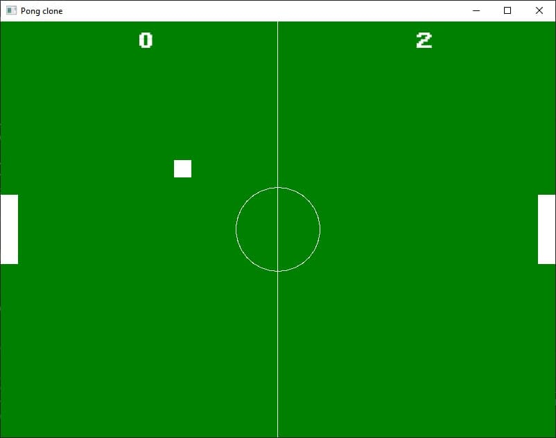
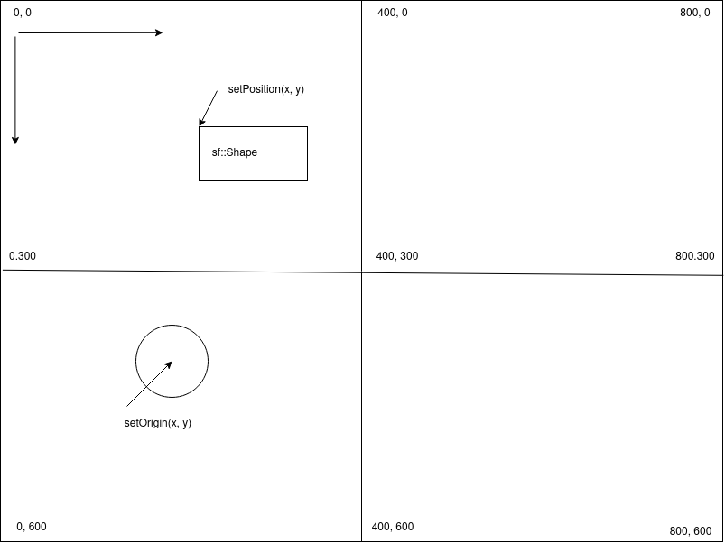

# Homework 1

Using [SMFL library](https://www.sfml-dev.org/), draw the Pong game as in the picture bellow:

Hints:
* shapes (circle, rectangle, line) https://www.sfml-dev.org/tutorials/2.5/graphics-shape.php
* text and fonts https://www.sfml-dev.org/tutorials/2.5/graphics-text.php
* [setPosition](https://www.sfml-dev.org/documentation/2.5.1/classsf_1_1Transformable.php#a4dbfb1a7c80688b0b4c477d706550208)
* [setOrigin](https://www.sfml-dev.org/documentation/2.5.1/classsf_1_1Transformable.php#a56c67bd80aae8418d13fb96c034d25ec)
* Coordinates in SFML are in pixels and they work as in the picture bellow:

* setPosition uses the default origin of a shape which is (0,0) relative to the object which means top left corner
* you can change the origin of a shape using setOrigin; that may come in handy for circles
